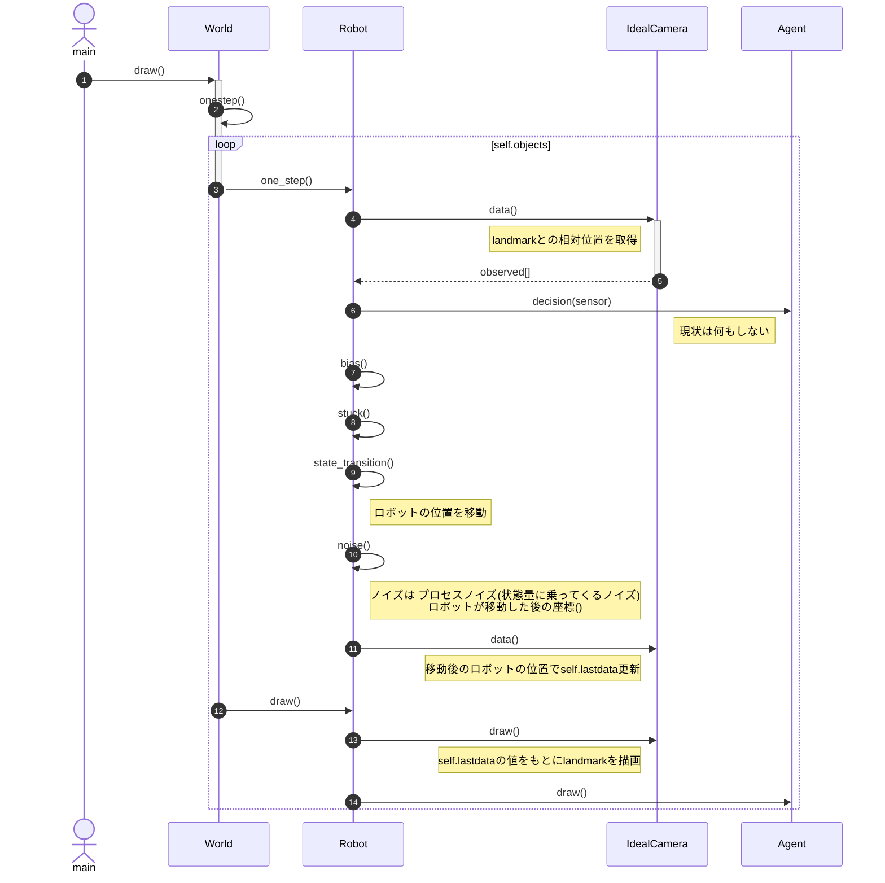

```mermaid
sequenceDiagram
    autonumber
    actor main
    participant world as World
    participant robot as Robot
    participant sensor as IdealCamera
    participant agent as Agent
    main->>+world: draw()
    world->>world: onestep()
    loop self.objects
        world->>-robot: one_step()
        robot->>+sensor: data()
        Note left of sensor: landmarkとの相対位置を取得
        sensor-->>-robot: observed[]
        robot->>agent: decision(sensor)
        Note left of agent: 現状は何もしない
        robot->>robot: bias()
        robot->>robot: stuck()
        robot->>robot: state_transition()
        Note right of robot: ロボットの位置を移動
        robot->>robot: noise()
        Note right of robot: ノイズは プロセスノイズ(状態量に乗ってくるノイズ)<br>ロボットが移動した後の座標()
        robot->>sensor: data()
        Note left of sensor: 移動後のロボットの位置でself.lastdata更新
        world->>robot: draw()
        robot->>sensor: draw()
        Note left of sensor: self.lastdataの値をもとにlandmarkを描画
        robot->>agent: draw()
    end

```
